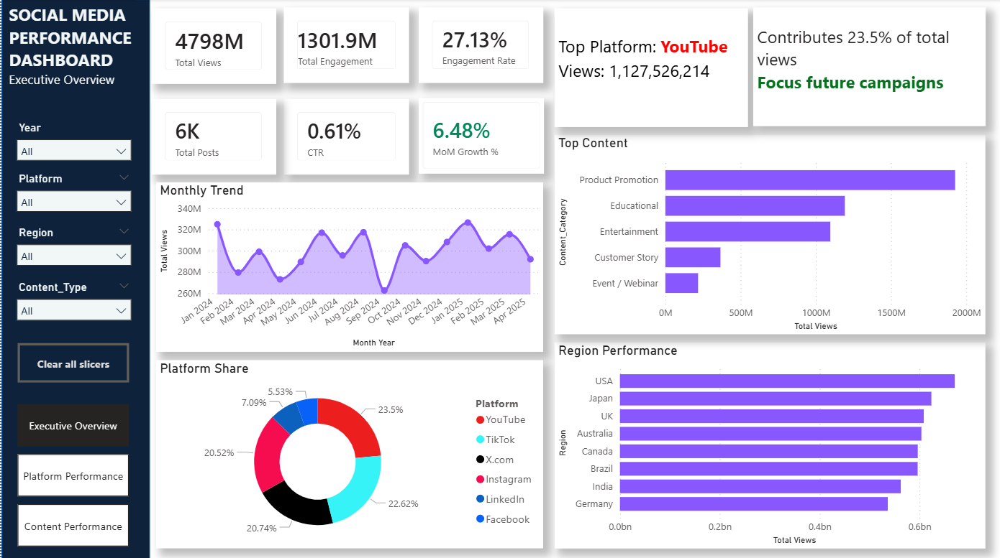
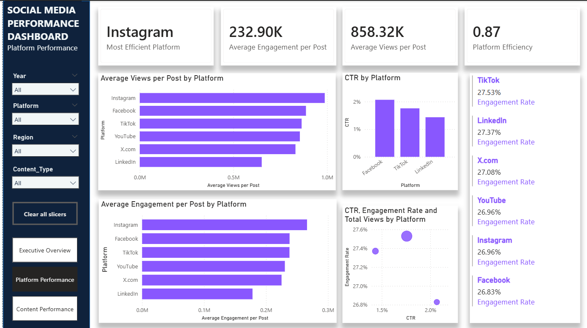
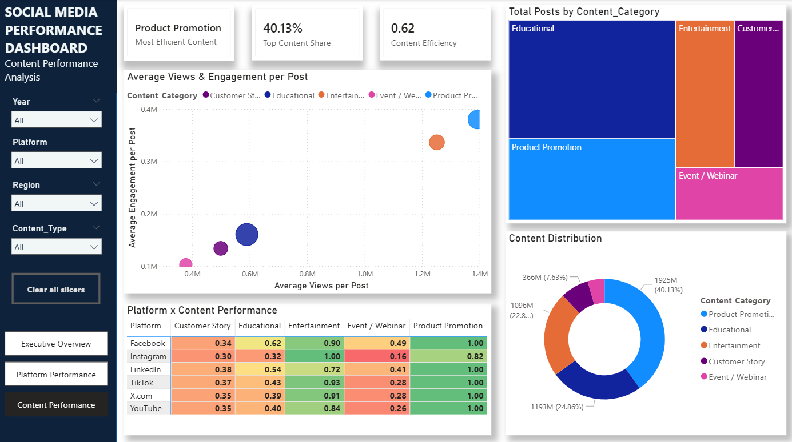

# Social Media Performance Dashboard

An interactive Power BI dashboard for analyzing social media performance across platforms, regions, content types, and content categories.

The dashboard focuses on three analytical perspectives:

- Executive-level performance monitoring
- Platform performance and efficiency
- Content performance and efficiency

---

## Dashboard Preview

### Executive Overview



### Platform Performance



### Content Performance



---

# 1. Project Overview

This project uses Power BI to transform social media post-performance data into an interactive analytical dashboard.

The dashboard allows users to evaluate:

- Overall social media reach and engagement
- Click-through performance
- Post volume and growth
- Platform-level efficiency
- Regional performance
- Content-type and content-category performance
- Relationships between reach, engagement, and CTR

The report is designed with interactive filtering so that users can analyze performance across different years, platforms, regions, and content types.

---

# 2. Dashboard Structure

The Power BI report contains three analytical pages.

## 2.1 Executive Overview

The Executive Overview provides a high-level summary of social media performance.

### Filters

- Year
- Platform
- Region
- Content Type

### KPI Cards

- Total Views
- Total Engagement
- CTR
- Engagement Rate
- Total Posts
- MoM Growth %

### Visual Analysis

- Monthly performance trend
- Views by platform
- Performance by region
- Views by content category

### Key analytical fields

The page uses:

- `Dim_Date[Month Year]`
- `Dim_Platform[Platform]`
- `Dim_Region[Region]`
- `Dim_Content[Content_Category]`

and the following measures:

- `Total Views`
- `Total Engagement`
- `CTR`
- `Engagement Rate`
- `Total Posts`
- `MoM Growth %`
- `Color_MoM`

---

## 2.2 Platform Performance

The Platform Performance page evaluates the relative performance and efficiency of social media platforms.

### Filters

- Year
- Platform
- Region
- Content Type

### KPI Cards

- Most Efficient Platform
- Average Views per Post
- Average Engagement per Post
- Platform Efficiency

### Visual Analysis

- Average views per post by platform
- Average engagement per post by platform
- CTR by platform
- Engagement rate by platform
- Relationship between CTR, engagement rate, and total views

### Key analytical fields

The page uses:

- `Dim_Platform[Platform]`

and the following measures:

- `Most Efficient Platform`
- `Average Views per Post`
- `Average Engagement per Post`
- `Platform Efficiency`
- `CTR`
- `Engagement Rate`
- `Total Views`

A scatter plot is used to compare:

- CTR
- Engagement Rate
- Total Views

across platforms.

---

## 2.3 Content Performance

The Content Performance page evaluates performance across content categories and platforms.

### Filters

- Year
- Platform
- Region
- Content Type

### KPI Cards

- Most Efficient Content
- Top Content Share
- Content Efficiency

### Visual Analysis

- Content efficiency by platform and content category
- Post distribution by content category
- View distribution by content category
- Relationship between average views per post and average engagement per post

### Key analytical fields

The page uses:

- `Dim_Content[Content_Category]`
- `Dim_Platform[Platform]`

and the following measures:

- `Most Efficient Content`
- `Top Content Share`
- `Content Efficiency`
- `Total Posts`
- `Total Views`
- `Average Views per Post`
- `Average Engagement per Post`

---

# 3. Data Model

The Power BI model contains the following tables:

### Fact Table

- `Fact_PostPerformance`

### Dimension Tables

- `Dim_Date`
- `Dim_Platform`
- `Dim_Region`
- `Dim_Content`
- `Dim_Hashtag`

### Measures Table

- `Measures_Table`

### Additional Model Table

- `MissingDateTable`

The model separates post-performance data from descriptive dimensions such as date, platform, region, content, and hashtag.

```text
                         Dim_Date
                            |
                            |
Dim_Platform ---- Fact_PostPerformance ---- Dim_Content
                            |
                            |
                       Dim_Region
                            |
                            |
                       Dim_Hashtag


                    Measures_Table
